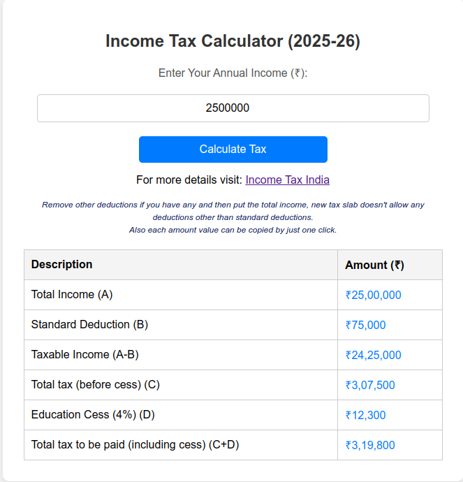

# Income Tax Calculator (2025-26)

A simple web-based tax calculator that helps users estimate their tax liability based on the new tax slabs.

## Features
- User-friendly UI with a responsive design.
- Calculates total tax, education cess, and total tax liability.
- Displays tax slabs (before calculation) and hides them after.
- Users can copy individual values with a click.
- Supports mobile and desktop views seamlessly.

## Technologies Used
- HTML, CSS, JavaScript

## Setup Instructions
1. Clone this repository:
   ```bash
   git clone https://github.com/your-repo/tax-calculator.git
   ```
2. Open `index.html` in a browser.

## Usage
1. Enter your annual income.
2. Click the **Calculate Tax** button.
3. View the calculated tax breakdown.
4. Click on any value to copy it to the clipboard.

## Tax Slabs (2025-26)
| Income Range        | Tax Rate |
|--------------------|----------|
| ₹0 - ₹4,00,000    | 5%       |
| ₹4,00,001 - ₹8,00,000  | 10%  |
| ₹8,00,001 - ₹12,00,000 | 15%  |
| ₹12,00,001 - ₹16,00,000 | 20% |
| ₹16,00,001 - ₹20,00,000 | 25% |
| ₹20,00,001+       | 30%     |

## Screenshot


## License
This project is licensed under the MIT License.
